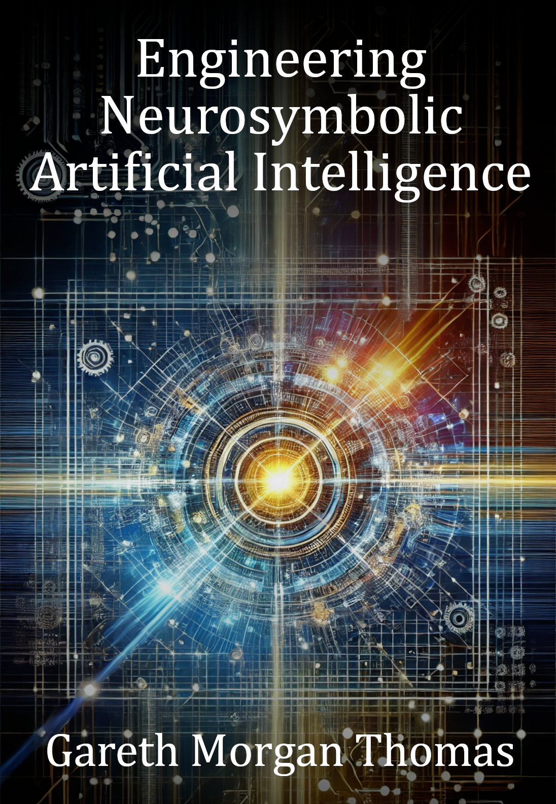

# Engineering Neurosymbolic Artificial Intelligence

### Cover

### Repository Structure
- `covers/`: Book cover images
- `blurbs/`: Promotional blurbs
- `infographics/`: Marketing visuals
- `source_code/`: Code samples
- `manuscript/`: Drafts and format.txt for TOC
- `marketing/`: Ads and press releases
- `additional_resources/`: Extras

View the live site at [burstbookspublishing.github.io/engineering-neurosymbolic-artificial-intelligence](https://burstbookspublishing.github.io/engineering-neurosymbolic-artificial-intelligence/)
---

- Neuro-Symbolic AI: The Integration of Knowledge and Learning

---
## Chapter 1. Foundations of Modern Artificial Intelligence
### Section 1. The Three Waves of AI
- First Wave: Rule-Based Systems
- Second Wave: Statistical Learning
- Third Wave: Hybrid Intelligence

### Section 2. The Limitations of Current AI Systems
- Deep Learning's Successes and Failures
- The Symbol Grounding Problem
- The Need for Reasoning in AI

### Section 3. Understanding Intelligence
- Human Cognitive Architecture
- The Role of Prior Knowledge
- Learning vs. Reasoning

---
## Chapter 2. Mathematical Foundations
### Section 1. Logic and Reasoning
- Propositional and First-Order Logic
- Probabilistic Logic
- Modal and Temporal Logic

### Section 2. Statistical Learning Theory
- PAC Learning
- VC Dimension and Generalization
- Information Theory in Learning

### Section 3. Optimization
- Gradient-Based Methods
- Discrete Optimization
- Constraint Satisfaction

---
## Chapter 3. Knowledge Representation
### Section 1. Symbolic Knowledge
- Ontologies and Knowledge Graphs
- Semantic Networks
- Frame Systems and Scripts

### Section 2. Neural Knowledge
- Distributed Representations
- Embedding Spaces
- Knowledge in Weights

### Section 3. Hybrid Knowledge Structures
- Tensorized Logic
- Neural-Symbolic Integration Patterns
- Knowledge Distillation

---
## Chapter 4. Physics Understanding and Emulation
### Section 1. Fundamentals of Physics in AI
- The Role of Physics in Cognitive Modeling
- Physics-Based Simulations in AI
- Constraints of Current AI Models in Emulating Physical Phenomena

### Section 2. Symbolic and Neural Approaches to Physical Systems
- Symbolic Representation of Physical Laws
- Learning Physical Dynamics with Neural Networks
- Integrating Neural-Symbolic Systems for Physics Emulation

### Section 3. Hybrid Models for Physical Reasoning
- Physics-Informed Neural Networks (PINNs)
- Differentiable Physics Engines
- Applications of Hybrid AI in Physics-Based Systems

### Section 4. Advanced Reasoning for Physics Understanding
- Simulating Common-Sense Physics
- Causal Inference in Physical Systems
- Counterfactual Reasoning in Physics Emulation

### Section 5. Practical Applications
- Robotics and Embodied Intelligence with Physical Constraints
- Physics-Based AI in Scientific Discovery
- Emulating Complex Systems: From Climate Modeling to Astrophysics

---
## Chapter 5. Learning Mechanisms
### Section 1. Statistical Learning
- Supervised Learning Theory
- Self-Supervised Learning
- Few-Shot and Zero-Shot Learning

### Section 2. Symbolic Learning
- Inductive Logic Programming
- Explanation-Based Learning
- Analogical Reasoning

### Section 3. Hybrid Learning Approaches
- Learning with Logical Constraints
- Neural-Guided Search
- Symbol Emergence in Neural Systems

---
## Chapter 6. Reasoning Systems
### Section 1. Logical Reasoning
- Automated Theorem Proving
- Answer Set Programming
- Probabilistic Logic Programming

### Section 2. Neural Reasoning
- Attention Mechanisms
- Memory Networks
- Neural Module Networks

### Section 3. Hybrid Reasoning
- Neural-Symbolic Theorem Proving
- Differentiable Reasoning
- Probabilistic Soft Logic

---
## Chapter 7. Advanced Neural Architectures
### Section 1. Modern Architecture Design
- Transformers and Beyond
- Graph Neural Networks
- Neural-Symbolic Architecture Patterns

### Section 2. Memory and State
- External Memory Architectures
- Differentiable Neural Computers
- Memory-Augmented Neural Networks

### Section 3. Learning to Learn
- Meta-Learning Architectures
- Neural Program Synthesis
- Architecture Search

---
## Chapter 8. Symbolic Systems Engineering
### Section 1. Knowledge Engineering
- Ontology Design Patterns
- Knowledge Base Construction
- Reasoning Engine Design

### Section 2. Logic Programming
- Modern Prolog Systems
- Answer Set Programming
- Constraint Logic Programming

### Section 3. Verification and Validation
- Formal Methods
- Model Checking
- Runtime Verification

---
## Chapter 9. Neural-Symbolic Integration
### Section 1. Integration Patterns
- Deep Learning with Symbolic Features
- Neural Predicates
- End-to-End Differentiable Logic

### Section 2. Learning and Reasoning Loop
- Neural Perception to Symbolic Knowledge
- Symbolic Reasoning to Neural Control
- Hybrid Learning Algorithms

### Section 3. System Architecture
- Component Integration
- Communication Protocols
- Performance Optimization

---
## Chapter 10. Language Understanding and Generation
### Section 1. Semantic Parsing
- Grammar-Guided Parsing
- Neural Semantic Parsing
- Hybrid Parsing Approaches

### Section 2. Reasoning About Language
- Natural Logic
- Textual Entailment
- Common Sense Reasoning

### Section 3. Knowledge-Enhanced Language Models
- Incorporating External Knowledge
- Structured Knowledge Prediction
- Faithful Generation

---
## Chapter 11. Visual Intelligence
### Section 1. Scene Understanding
- Object-Centric Learning
- Relational Scene Graphs
- Physical Scene Understanding

### Section 2. Visual Reasoning
- Program-Guided Reasoning
- Neuro-Symbolic Concept Learning
- Multi-Modal Integration

### Section 3. Generation and Control
- Structured Image Generation
- Scene Manipulation
- Visual Planning

---
## Chapter 12. Robotics and Embodied Intelligence
### Section 1. Perception-Action Loops
- Sensorimotor Integration
- Affordance Learning
- Skill Acquisition

### Section 2. Task and Motion Planning
- Symbolic Planning
- Neural Motion Control
- Integrated Task-Motion Planning

### Section 3. Learning from Demonstration
- Program Synthesis from Demonstration
- Hybrid Imitation Learning
- Interactive Learning

---
## Chapter 13. Scientific Discovery
### Section 1. Automated Discovery
- Hypothesis Generation
- Experimental Design
- Theory Formation

### Section 2. Knowledge-Guided Learning
- Physics-Informed Neural Networks
- Scientific Law Discovery
- Causal Discovery

### Section 3. Interpretable Science AI
- Explainable Scientific Models
- Theory-Guided Data Science
- Scientific Knowledge Graphs

---
## Chapter 14. Practical Implementation
### Section 1. Software Architecture
- Neural-Symbolic Frameworks
- Integration Patterns
- Performance Optimization

### Section 2. Development Workflow
- Knowledge Engineering
- Model Development
- System Integration

### Section 3. Deployment Considerations
- Scaling Strategies
- Monitoring and Maintenance
- Error Handling

---
## Chapter 15. Evaluation and Benchmarking
### Section 1. Evaluation Metrics
- Reasoning Correctness
- Learning Efficiency
- System Robustness

### Section 2. Benchmark Suites
- Reasoning Tasks
- Learning Challenges
- Real-World Applications

### Section 3. Analysis Methods
- Error Analysis
- Ablation Studies
- Comparative Evaluation

---
## Chapter 16. Safety and Reliability
### Section 1. Formal Verification
- Property Verification
- Runtime Monitoring
- Safety Guarantees

### Section 2. Robustness
- Adversarial Robustness
- Distribution Shift
- Uncertainty Quantification

### Section 3. Ethical Considerations
- Bias and Fairness
- Transparency
- Accountability

---
## Chapter 17. Future Directions
### Section 1. Research Frontiers
- Scalable Reasoning
- Continuous Learning
- Common Sense AI

### Section 2. Emerging Applications
- Scientific Discovery
- Healthcare
- Climate Change

### Section 3. Societal Impact
- Economic Impact
- Educational Opportunities
- Policy Implications

---
## Chapter 18. Mathematical Background
### Section 1. Core Math
- Logic and Set Theory
- Probability and Statistics
- Optimization Theory

---
## Chapter 19. Implementation Resources
### Section 1. Available Tools
- Software Frameworks
- Development Tools

---
## Chapter 20. Research Resources
### Section 1. reaserch Tools
- Key Papers
- Datasets
- Research Groups and Conferences
---
